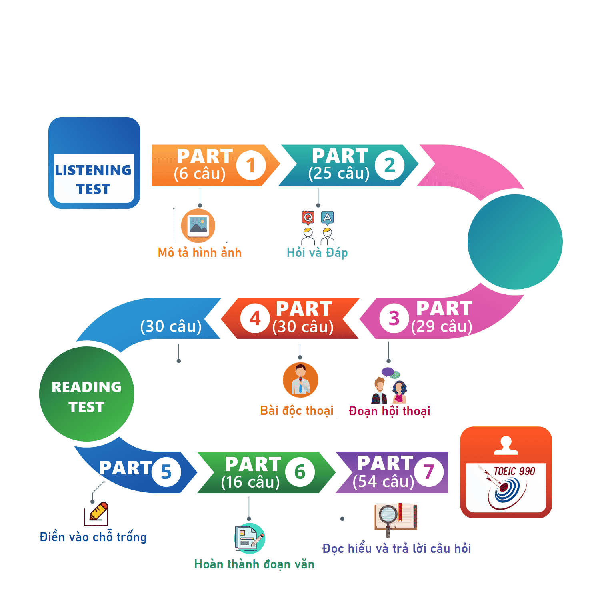

  

## Mục lục

### 🎯 Chủ đề

---

1. [Thì](/topics/12-tenses/README.md)
2. [Từ loại](/topics/parts-of-speech/README.md)
3. [Mẹo toeic part 1](/topics/toeic/part-1.md)
4. [Mẹo toeic part 2](/topics/toeic/part-2.md)
5. [Mẹo toeic part 3](/topics/toeic/part-3.md)
6. [Mẹo toeic part 4](/topics/toeic/part-4.md)
7. [Mẹo toeic part 5](/topics/toeic/part-5.md)
8. [Mẹo toeic part 6](/topics/toeic/part-6.md)
9. [Mẹo toeic part 7](/topics/toeic/part-7.md)
10. 

## Tác giả

- **MinhQuan**
In QA 123, we confirmed that SQL008 of API A should be the same as SQL001 of API B.
Since SQL001 is used for searching and SQL008 is used for verification and update, both SQL statements must be consistent.

However, SQL001 has already been updated, so please update SQL008 accordingly to match SQL001.
